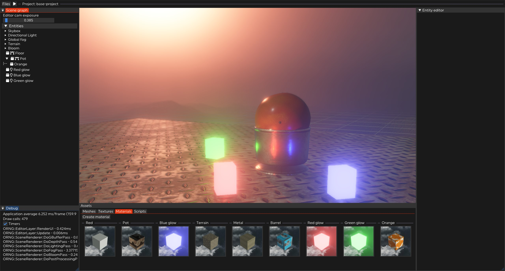

 ## ORNG Engine
 This is a hobby windows-based OpenGL 3D game engine project, currently not in a state to be used. It is not documented and still requires a lot of work. This is my first attempt building a game engine.

 However, if you do decide to try and build, it is currently only properly supported for MSVC using VS (and only tested on VS2022), there are plans to change this, but it is currently non-urgent for me. Cloning this repo recursively and opening the folder in VS should allow you to build error-free. Make sure the editor .exe is set as the startup item.

 ### Controls:
 * Move camera: Hold right mouse, WASD + mouse controls
 * Close window/delete component: double right click on header/title bar
 * Drag and drop assets
 * Create entity: right click on "Scene graph" window
 * Duplicate selected entities: Ctrl+D
 * Reset editor cam: K
 

### Currently, features include:
* Visual editor with a simulation mode, uses ImGui for UI
* Deferred PBR-based 3D renderer
* C++ scripting (supports runtime editing/reloading)
* 3D GPU Physics using Nvidia Physx
* Procedural terrain generation with quad-tree based LOD and frustum culling
* Volumetric fog
* Stable cascaded shadow maps with PCSS
* ECS integration using entt library
* HDRI environment map support
* Normal, parallax and emissive map support
* Mesh/texture file loading and binary serialization/deserialization
* YAML serialization of scenes
* Editor "Projects" (saves)
* Postprocessing such as HDR, gamma correction and bloom
* Point/spot/directional lights with shadows
* Auto-instancing of meshes
* Event-driven architecture

