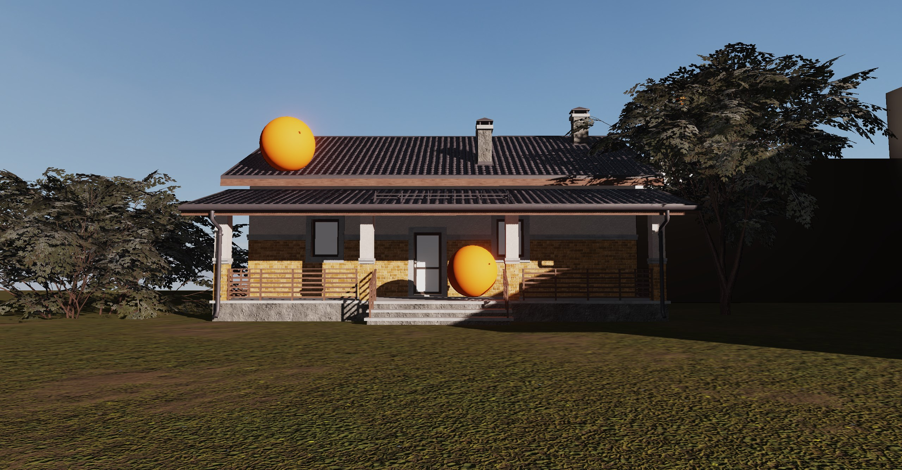
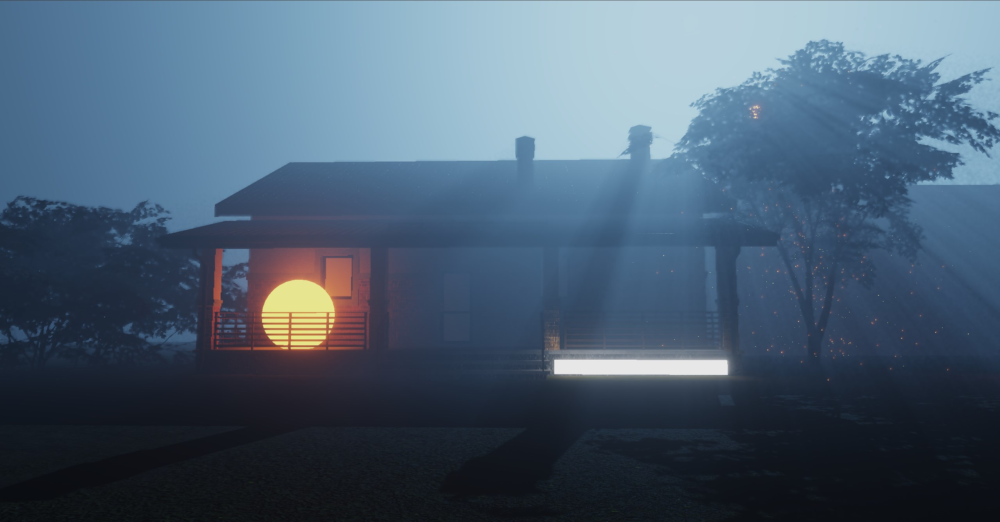
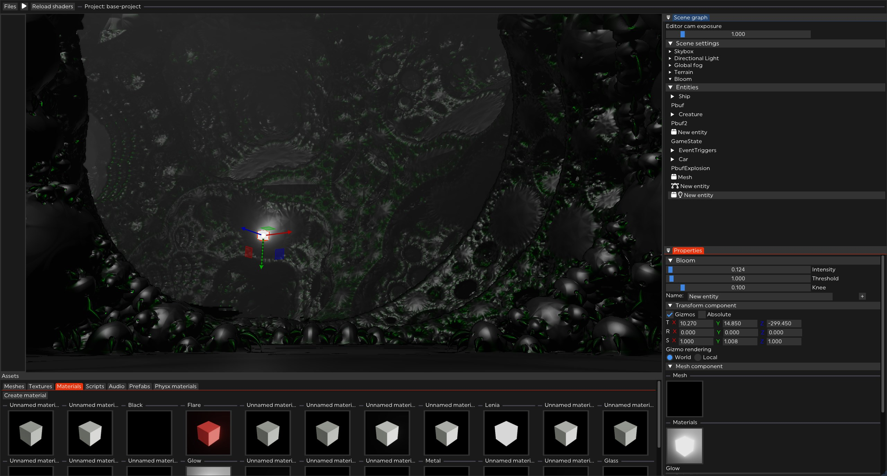

 ## ORNG Engine
 This is a hobby windows-based OpenGL 3D game engine. It is not really intended for use by anyone other than me however feel free to look at the code or try to build/use it. There are very frequent breaking changes and it is not properly documented currently.

In-engine screenshots (Not my 3D models/textures, credit to the original authors)

&nbsp;

Editor screenshot and some fractal rendering

### Building: 
Cloning this repo recursively and opening it with VS2022 should allow you to compile and run the engine, make sure the editor exe is set as the startup item in VS. The editor will only work with the MSVC compiler due to the scripting engine relying on it, I have not tested any environments other than VS2022 and I don't expect this to work on them yet.

 ### Controls:
 * Move camera: Hold right mouse, WASD + mouse controls
 * Close window/delete component: double right click on header/title bar
 * Drag and drop assets
 * Create entity: right click on "Scene graph" window or drag/drop mesh asset in scene view panel
 * Duplicate selected entities: Ctrl+D
 * Make editor cam active: K
 * Ctrl+z/Ctrl+shift+z undo/redo
 

### Currently, features include:
* Visual editor with a state-preserving simulation mode and lua console, uses ImGui for UI
* Deferred PBR 3D renderer
* Cascaded voxel cone traced global illumination
* C++ scripting (supports runtime editing/reloading)
* 3D GPU Physics using Nvidia Physx
* GPU-driven particle system
* Procedural terrain generation with quad-tree based LOD and frustum culling
* Volumetric fog
* Stable cascaded shadow maps with PCSS
* ECS integration using entt library
* HDRI environment map support
* Normal, parallax and emissive map support
* Mesh/texture file loading and binary serialization/deserialization
* YAML serialization of scenes
* Editor "Projects" (saves)
* Postprocessing such as HDR, gamma correction and bloom
* Point/spot/directional lights with shadows
* Auto-instancing of meshes
* Event-driven architecture

